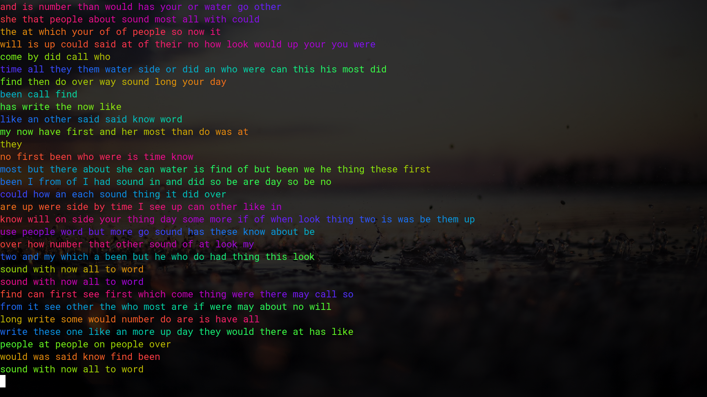

# code-examples

This repository serves as my code practice outside of school, making only things I find interesting. I am very passionate about the C Programming Language and so I'm using this project as my coding playground, hence the name **code-examples**.

For my **word-randomizer**, in order to get a large list of words I used [a site listing the top 500 most commonly used English words](https://www.smart-words.org/500-most-commonly-used-english-words.html) and a Vim macro to place them each on separate lines. Be sure to send a pull request if you may wish to add more words to the pool. I've found that using more than 255 words at one time causes the sentences in the output to make less sense, hence all the comments past that line number.

In order to use the compilation script ``co`` you may need to install the following packages:

  * git
  * gcc
  * g++
  * fzf

# Examples in action

 [Lolcat](https://github.com/busyloop/lolcat) + word-randomizer
